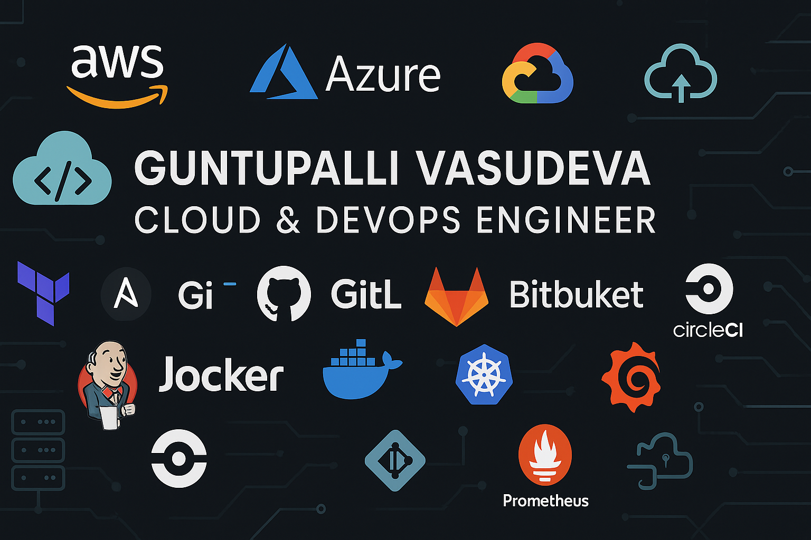

## Hi there 👋

# ☁️ Guntupalli Vasudeva — Cloud & DevOps Engineer

**Cloud-Native Enthusiast | Infrastructure as Code Advocate | CI/CD Automator**

---

## 👨‍💻 About Me

I'm **Guntupalli Vasudeva**, a dedicated **Cloud & DevOps Engineer** focused on automating infrastructure, securing deployments, and implementing cloud-native solutions that scale. I specialize in building resilient systems using Infrastructure as Code (IaC), CI/CD pipelines, container orchestration, and monitoring.

With hands-on experience across **AWS, Azure, and GCP**, I bring together the best of open-source tools and cloud services to streamline development workflows and improve system reliability. I'm passionate about scripting, automation, security, and all things DevOps.

---

## 🛠️ Tech Stack

### ☁️ Cloud Platforms

### 🔧 Infrastructure as Code (IaC)

### ⚙️ DevOps & Automation

### 🐳 Containers & Orchestration

### 📈 Monitoring & Logging

---

## 🎓 Education

- **B.Tech in Computer Science & Engineering**, Anurag University  
  *2021 – 2025*
  - Focus: Cloud Infrastructure, Security, Automation  
  - Projects: AWS Automation, CI/CD Pipelines

- **Certifications**  
  - AWS Certified Solutions Architect – Associate  
  - Azure Fundamentals (AZ-900)  
  - Terraform Associate (In Progress)  
  - CKA (In Progress)
  - Git & GitHub Foundations  
  - GitHub Actions CI/CD  
  - Docker & Kubernetes – Udemy

---

## 📈 GitHub Stats

---

## 💼 Contact Me

- 📧 Email: guntupallivasudeva@example.com  
- 🌐 Portfolio: https://your-portfolio-link.com  
- 💬 LinkedIn: https://linkedin.com/in/guntupalli-vasudeva  

